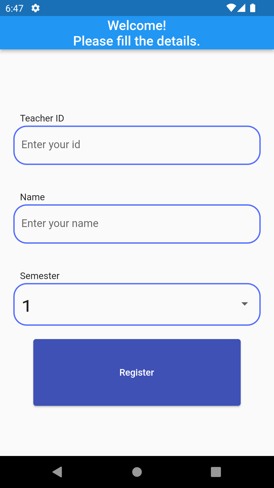
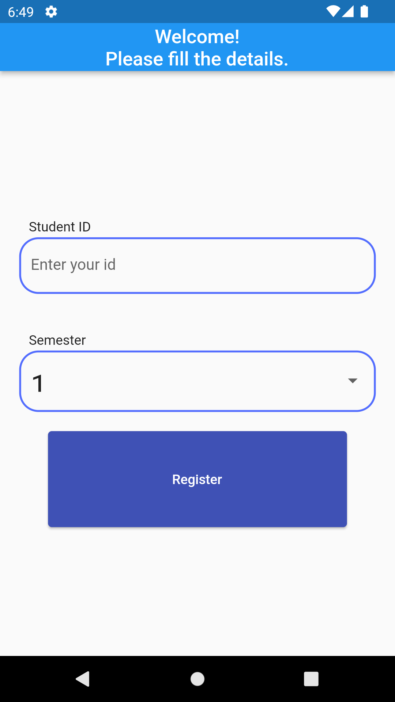

# demo_ui

A new Flutter project

<table>
     <tr>
        <th><h3><b>Splash Screen</b></h3></th>
        <th><h3><b>Home Page</b></h3></th>
        <th><h3><b>Faculty Login</b></h3></th>
        <th><h3><b>Student Login</b></h3></th>
    </tr>
    <tr>
        <td>
        
        </td>
        <td>
        
        </td>
        <td>
        
        </td>
        <td>
        
        </td>
    </tr>
</table>

